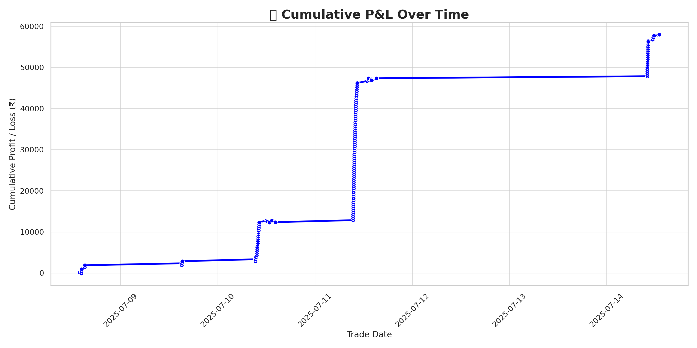

# 👋 Hi, I'm Abhay Shahkar Jha

🎯 Algo Trader | 🐍 Python Developer | 📊 Backtester  
🚀 Building Automated Strategies using Fyers API, Heikin-Ashi, EMA, RSI, ADX  
📘 Author of *Python Strategies for Finance Professionals*  
🔗 GitHub Repo: [Algo-strategy](https://github.com/Abhaypjha/Algo-strategy)

---

## 📈 Strategy P&L Chart (Live Paper Trades)

## 📈 Strategy Performance Dashboard

## 🛠️ Tech Stack

- **Languages:** Python, Pandas, NumPy  
- **Trading APIs:** Fyers API, yFinance  
- **Capabilities:** Backtesting | Paper Trading | Live Execution  
- **Other:** Excel Automation, GitHub Integration, Logging

---

## 🔥 Featured Projects

- 📌 [Algo-strategy](https://github.com/Abhaypjha/Algo-strategy)  
- 📌 [Live_trading](https://github.com/Abhaypjha/Live_trading)

---

## 📫 Contact

- 📧 abhaypjha@gmail.com  
- 🔗 [LinkedIn](https://www.linkedin.com/in/abhay-jha-a93b33a1)  
- 🌐 [GitHub Profile](https://github.com/Abhaypjha)  
- 🕒 Time Zone: IST (UTC +5:30)

---

## 📊 GitHub Stats

---

🧠 *Let your trades be automated. Let your strategies speak through charts.*  
📘 *— Abhay Shahkar Jha*
